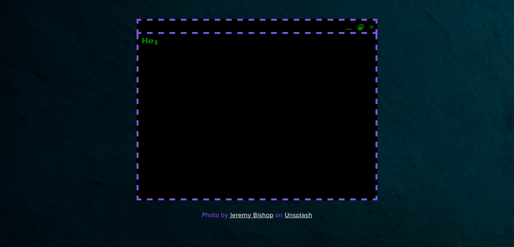

# Rocketseat - 21 days of code

This is a repo to manage all projects constructs on 21 days of code challenge from rocketseat.

## Table of contents

- [The challenge rules](#the-challenge-rules)
- [Day 1](#day-1)
  - [Overview](#day-1-overview)
- [Day 2](#day-2)
  - [Overview](#day-2-overview)
  - [Screenshot](#screenshot)
  - [Links](#links)
  - [What i Learned](#what-i-learned)
- [Author](#author)

## The challenge Rules

- code everyday at least 1 hour

- share every day your progress and mark @rocketseat_oficial using #21diasdecodigo hashtag

## Day 1

### Day 1 Overview

Create a repository to list all projects developed in challenge.

## Day 2

### Day 2 Overview

build a custom hello world with fonts, colors and images.

### Screenshot

### Links

- Live Site URL: [day 2](https://jalves.dev.br/portfolio/projects/21-days-of-code/day-02/)

### What I learned

Use javascript and css to create a typewriter animation.

### Useful resources

- [codefoxx](https://www.youtube.com/watch?v=h_Uv_9OxA2k) - provided a tutorial from where i'm learnet the animation above.

- [unsplash](https://unsplash.com/) - provided image to background.

## Author

- Website - [jalves.dev.br](http://jalves.dev.br/)
- Frontend Mentor - [@jalvesdev](https://www.frontendmentor.io/profile/jalvesdev)
- Twitter - [@jalves_dev](https://twitter.com/jalves_dev)